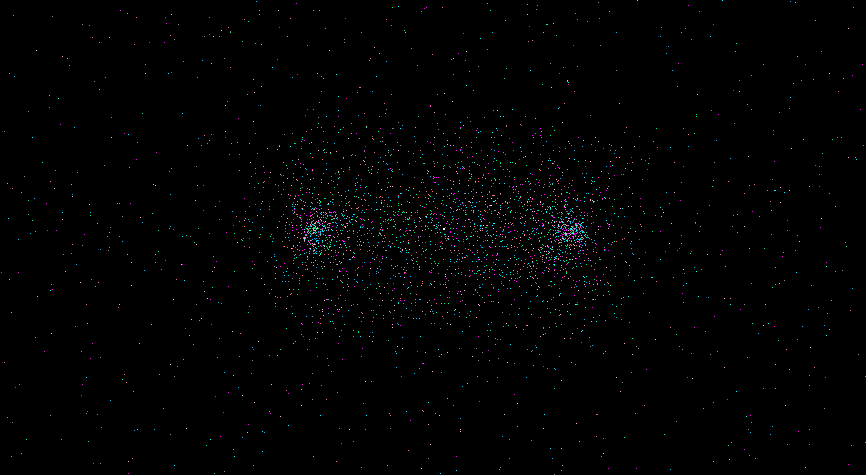
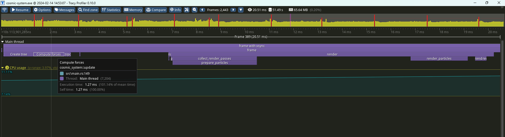

# Cosmic System

Implements the Barnes Hut Algorithm in Rust, and uses comfy to render the simulation.
I wonder if the easy Rust translation will be much faster than the Java version.

It looks like this with 10001 particles.

And the performance in release mode is acceptable.

(Rendering with comfy takes way longer than computing.)
